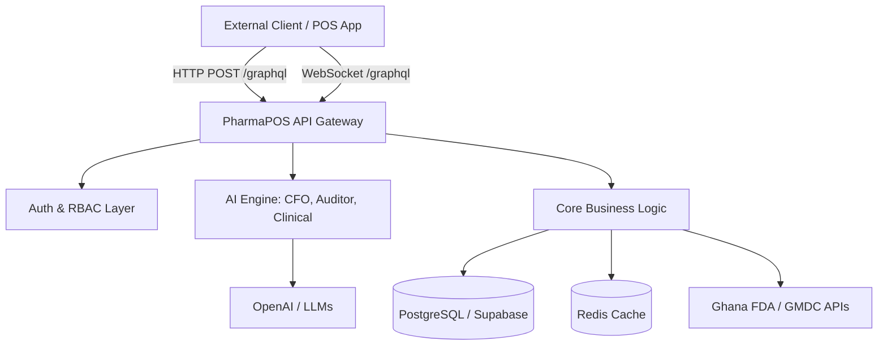

# PharmaPOS Pro — Developer API Reference

Welcome to the **PharmaPOS Pro API**. We are redefining pharmaceutical retail infrastructure by combining a lightning-fast GraphQL core with native AI capabilities, including a Virtual CFO, Internal Auditor, and clinical intelligence.

This document serves as the primary integration guide for external developers, partners, and integrators.

For **this repository** (PharmaPOS Web on Next.js), HTTP routing, environment variables, and CORS/proxy behavior are documented in [`API_TEAM_HANDOFF.md`](./API_TEAM_HANDOFF.md). GraphQL operations used by the app live under `src/lib/graphql/`.

---

## 🏗 Architecture Overview

PharmaPOS Pro is built on a modern, code-first **GraphQL** architecture. We expose a single, unified graph for all business operations, ensuring clients only fetch exactly the data they need.



### Key Principles

1. **GraphQL First**: All business logic (POS, Inventory, Accounting, Staff, Rx) is exposed via `POST /graphql`.
2. **Real-time Subscriptions**: Live updates (e.g., new prescriptions, stock alerts) use the `graphql-ws` protocol over WebSockets.
3. **Strict RBAC**: Every operation is protected by Role-Based Access Control (RBAC) and branch-level isolation.
4. **AI-Native**: Endpoints don't just return data; they return intelligence (e.g., query fields `cfoBriefing`, `internalAuditReport`).

---

## ✅ PharmaPOS Web (this repo) — alignment

The web app uses the same GraphQL schema as external clients, with these integration details:

| Topic | Behavior |
|--------|----------|
| **Browser HTTP** | Requests go to **same-origin** `/api/graphql`. Next.js rewrites that path to the backend `POST /graphql` (see `next.config.ts`). Avoids CORS for the browser. |
| **Server (SSR)** | Uses `API_PROXY_TARGET` or `NEXT_PUBLIC_API_URL` (base URL **without** `/graphql`) plus `/graphql` — see `src/lib/apollo/graphql-uri.ts`. |
| **WebSocket** | `graphql-ws` with `connectionParams` `{ Authorization: "Bearer <access_token>" }` — see `src/lib/apollo/apollo-provider.tsx`. |
| **Operations** | Defined in `src/lib/graphql/*.ts` (e.g. `CFO_BRIEFING`, `INTERNAL_AUDIT_REPORT`, `CREATE_SALE`, `INVENTORY_LIST_QUERY`). |

Examples below may show **minimal** field sets; the production schema and this app often expose **additional** fields. Where they differ, the tables in each subsection name the fields the web client actually selects.

---

## 🌐 API Surfaces

| Surface | Base path | Purpose |
|--------|-----------|---------|
| **GraphQL** | `POST /graphql` | All business operations (Auth, POS, Rx, Inventory, Accounting, Staff, AI) |
| **GraphQL WS** | `ws://host/graphql` (or `wss://`) | Real-time Subscriptions (`graphql-ws` protocol) |
| **REST** | `GET /health/*` | Infra health probes only (used by Kubernetes/AWS) |

> **Developer Tools:** In development environments, you can access the interactive **GraphQL Playground** at `GET /graphql` and the **Swagger UI** (for REST health probes) at `GET /api-docs`.

---

## 🔐 Authentication & Transport

### Request Format

All GraphQL requests must be sent as `POST` requests with a JSON body.

- **URL:** `/graphql`
- **Headers:**
  - `Content-Type: application/json`
  - `Authorization: Bearer <access_token>`

### Body Shape

```json
{
  "query": "query { ... }",
  "variables": { "key": "value" },
  "operationName": "OptionalName"
}
```

### Obtaining a Token (Login)

To authenticate, use the `login` mutation. This is one of the few endpoints that does not require an `Authorization` header.

**Request:**

```graphql
mutation Login($email: String!, $password: String!) {
  login(input: { email: $email, password: $password }) {
    access_token
    refresh_token
    expires_in
    user {
      id
      name
      role
      branch_id
    }
  }
}
```

**Response:**

```json
{
  "data": {
    "login": {
      "access_token": "eyJhbGciOiJIUzI1NiIsInR...",
      "refresh_token": "def456...",
      "expires_in": 900,
      "user": {
        "id": "uuid",
        "name": "Azzay Owner",
        "role": "owner",
        "branch_id": "uuid"
      }
    }
  }
}
```

---

## 🧠 AI & Intelligence Endpoints

PharmaPOS Pro is the first POS to include built-in AI agents. These are accessible via standard GraphQL queries.

### 1. Virtual CFO (query field `cfoBriefing`)

Analyzes the branch ledger, calculates runway, detects revenue signals, and provides actionable investment ideas.

Minimal illustrative query:

```graphql
query GetCfoBriefing {
  cfoBriefing {
    executiveSummary
    healthScoreNumeric
    monthRevenueFormatted
    workingCapital {
      healthStatus
      narrative
    }
    investmentIntelligence {
      qualifiesForInvestment
      recommendations {
        title
        rationale
        estimatedRoi12MonthPct
      }
    }
  }
}
```

Subfields under `workingCapital` / `investmentIntelligence` are **examples**; names and shapes vary by schema version — confirm in GraphQL Playground.

**PharmaPOS Web:** The deployed app uses a broader selection (e.g. `branchName`, `generatedAt`, `alerts`, `keyRatios`, `revenueIntelligence`, `monthRevenuePesewas`, detailed `workingCapital` pesewas/formatted fields, and richer `investmentIntelligence.recommendations`). See `CFO_BRIEFING` in `src/lib/graphql/accounting.queries.ts`. The schema may also expose `overallHealthScore` or `monthNetProfitFormatted`; request them in GraphQL Playground if your schema includes them.

### 2. Internal Auditor (query field `internalAuditReport`)

Scans the database for compliance violations, financial anomalies, and staff behavior risks.

The API takes a single **`AuditPeriodInput`** variable (not two top-level query variables):

```graphql
query InternalAuditReport($input: AuditPeriodInput!) {
  internalAuditReport(input: $input) {
    overallRiskScore
    overallRiskRating
    auditorOpinion
    opinionNarrative
    dispensingCompliance {
      pomSalesWithoutRxCount
      rxWithoutGmdcValidationCount
    }
    financialIntegrity {
      voidRatePct
      refundRatePct
    }
  }
}
```

Variables: `{ "input": { "periodStart": "2026-01-01", "periodEnd": "2026-01-31" } }`.

**PharmaPOS Web:** Full audit shape with `FINDING_FRAGMENT`, nested `findings`, `inventoryIntegrity`, `taxCompliance`, `licenceCompliance`, `staffProfiles`, etc. — see `INTERNAL_AUDIT_REPORT` in `src/lib/graphql/audit.queries.ts`. Older sketches sometimes used `executiveSummary` or counters named `pomViolationsCount`; the integrated client uses the fields above.

### 3. Clinical Intelligence

Drug interaction checking is performed automatically during prescription verification and sale creation. The system checks for interactions between prescribed medications and blocks contraindicated combinations at the API level.

---

## 🛒 Core Business Operations

### Point of Sale (POS)

Record a sale with offline-first idempotency.

```graphql
mutation CreateSale($input: CreateSaleInput!) {
  createSale(input: $input) {
    id
    totalPesewas
    totalFormatted
    status
    items {
      productId
      quantity
      stockAfterSale
    }
  }
}
```

**PharmaPOS Web:** Matches `CREATE_SALE` in `src/lib/graphql/sales.mutations.ts` (also requests `vatPesewas`, `soldAt`, `idempotencyKey`, per-item `reorderLevel`, `stockStatus`). If your schema exposes `totalAmountFormatted` or line-level `unitPriceFormatted`, add them to your selection set as needed.

### Inventory Management

Track stock levels, expiry dates, and reorder alerts.

JWT-authenticated clients often resolve the branch from the token and call **inventory without arguments**:

```graphql
query InventoryList {
  inventory {
    productId
    productName
    classification
    quantityOnHand
    reorderLevel
    stockStatus
    nearestExpiry
    supplierId
    supplierName
  }
}
```

**PharmaPOS Web:** Uses `INVENTORY_LIST_QUERY` in `src/lib/graphql/inventory.queries.ts` (no `branchId` argument). Some integrations or admin tools may instead use `inventory(branchId: $branchId)` with batches/expiry detail — confirm the argument and nested types in your schema.

```graphql
query GetInventory($branchId: String!) {
  inventory(branchId: $branchId) {
    productId
    productName
    quantityOnHand
    reorderLevel
    status
    batches {
      batchNumber
      expiryDate
    }
  }
}
```

---

## 📡 WebSockets (Real-time Subscriptions)

To listen for live events (e.g., a new prescription arriving from a doctor), connect via WebSockets using the `graphql-ws` protocol.

- **URL:** `wss://api.pharmapos.com/graphql`
- **Auth:** Send the JWT in the `connectionParams` during the initial handshake:

  ```json
  {
    "Authorization": "Bearer <access_token>"
  }
  ```

---

## 🚨 Error Handling

PharmaPOS Pro uses standard GraphQL error formatting, enriched with custom extension codes for programmatic handling.

```json
{
  "errors": [
    {
      "message": "Prescriber licence is invalid or expired",
      "extensions": {
        "code": "GMDC_INVALID_LICENCE",
        "statusCode": 400
      }
    }
  ],
  "data": null
}
```

**PharmaPOS Web:** UI helpers prefer `errors[0].message` (and network body errors when present) — see `src/lib/apollo/format-apollo-error.ts`. You can additionally read `errors[0].extensions?.code` for branching logic.

**Common Error Codes:**

- `UNAUTHENTICATED`: Missing or invalid JWT.
- `FORBIDDEN`: User lacks the required RBAC role.
- `FDA_POM_VIOLATION`: Attempted to sell a Prescription-Only Medicine without a verified Rx.
- `GMDC_INVALID_LICENCE`: The doctor's licence failed validation against the Ghana Medical and Dental Council.
- `FDA_DRUG_CONTRAINDICATED`: Severe drug interaction detected; sale blocked.

---

## 🏥 Compliance & Regulatory

PharmaPOS Pro enforces strict regulatory compliance at the API level. External clients **cannot** bypass these rules:

- **POM Enforcement:** Prescription-Only Medicines cannot be checked out without a linked, verified `prescription_id`.
- **Chemical Shop Isolation:** Branches designated as "chemical shops" are hard-blocked from accessing or selling POMs.
- **Audit Logging:** Every critical action (Rx verification, price changes, refunds) is written to an immutable, append-only PostgreSQL audit log.

---

## 🛠 Next Steps for Developers

1. **Explore the Schema:** Download the full `schema.gql` or use the GraphQL Playground to explore types, inputs, and documentation strings.
2. **Authentication:** Implement the `login` mutation and ensure your client attaches the `Authorization` header to all subsequent requests.
3. **Offline Support:** If building a POS client, ensure you generate UUIDs client-side and use the `idempotencyKey` field on mutations to safely sync offline transactions when connectivity is restored.
